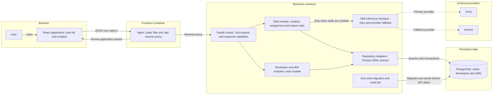
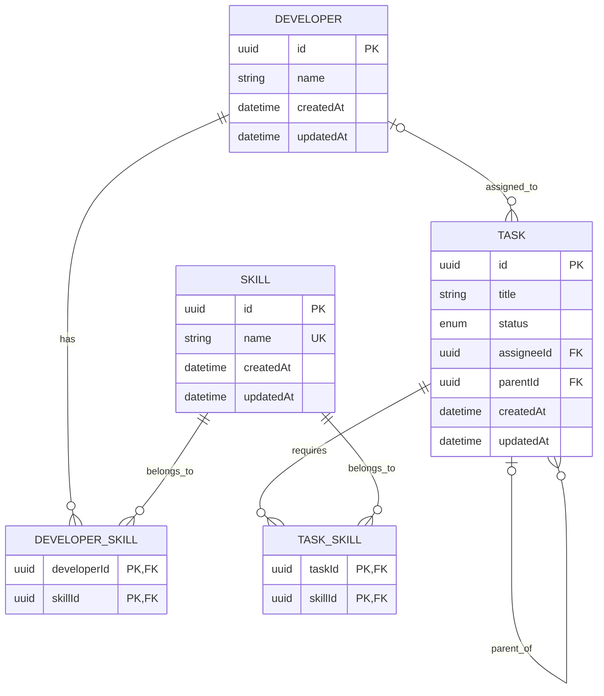

# System Design

## Overview

I designed this as a small task-assignment system with three independently deployable runtime units: a React frontend, a Fastify backend, and PostgreSQL. The backend owns the business rules and persistence. The frontend adds early validation and filters invalid choices for a better user experience, but it is not treated as a trust boundary.

The one external dependency in the main write path is skill inference. When a user creates a task without selecting skills, the backend asks an LLM to choose from the skills currently stored in PostgreSQL. Groq is attempted first when configured, with Gemini as the fallback. If the user supplies skills explicitly, the LLM path is skipped entirely.

## Architecture

In local frontend development, the browser calls `http://localhost:3001` directly. In the containerised setup, Nginx serves the built frontend and proxies `/api/*` to the backend, removing the `/api` prefix. The backend itself exposes `/v1/*` routes.

## Main request paths

### Reading the workspace

The task list loads `GET /v1/tasks` and `GET /v1/developers` concurrently. PostgreSQL returns tasks as flat rows with their assignee and skill relations; the task module rebuilds the nested hierarchy in memory before returning it. The frontend then performs search, filtering, tree expansion, summary counts, and eligible-developer filtering locally.

The read endpoints are:

| Endpoint | Purpose |
| --- | --- |
| `GET /health` | Process-level health check |
| `GET /v1/tasks` | Return all tasks as nested task trees |
| `GET /v1/developers` | Return developers with their skills |
| `GET /v1/skills` | Return the current skill catalog |

### Creating a task tree

`POST /v1/tasks` accepts a root task and its recursively nested subtasks in one request. I split creation into a preparation phase and a persistence phase:

1. Fastify and Zod validate the request shape.
2. For each node, explicit skill IDs are checked against PostgreSQL. If no skills were supplied, the backend loads the skill catalog and runs inference.
3. Any selected assignee is checked to ensure that the developer owns every required skill.
4. Only after the complete tree has been prepared does the repository open a transaction.
5. The root, descendants, and task-skill rows are inserted recursively. Any failure rolls back the entire tree.

The skill catalog is loaded at most once per create request and reused for every node that needs inference. LLM calls intentionally happen before the database transaction so provider latency, timeout, retry, or fallback never holds database locks.

### Updating assignment or status

`PATCH /v1/tasks/:id` accepts a status, assignee, title, or a combination of those fields. The backend checks the current task before writing:

- an assignee must exist and possess all of the task's required skills;
- a task cannot move to `DONE` while a direct subtask is unfinished;
- reopening a completed task also reopens completed ancestors to `IN_PROGRESS` in the same transaction.

After an update, the current implementation reloads the task hierarchy and returns the updated node. The frontend also reloads the hierarchy after a patch because an ancestor may have changed.

## Data model

The main relationships are:

I kept skills as records and used join tables instead of embedding names or adding fields such as `isFrontend`. This allows the catalog to grow without a schema or application change. Tasks and subtasks share one table through a self-referencing `parentId`, so the same rules and response shape apply at every level.

## Design considerations

### Business rules have one authoritative home

The frontend hides ineligible developers and prevents an obviously invalid completion, but the backend repeats every important check. A caller can bypass the React application, so assignment compatibility and task-state invariants must be enforced in the task module before persistence.

PostgreSQL provides the final integrity guard through foreign keys, unique constraints, composite keys, and the `TaskStatus` enum. Application validation gives useful errors; database constraints prevent invalid relationships during races or programming mistakes.

### The LLM sits behind a narrow seam

Task creation depends on a small `SkillInferenceService` interface rather than on either SDK directly. Groq and Gemini are adapters at that seam, while the fallback module controls provider order. This keeps provider-specific request formats, timeouts, structured output, error normalisation, and retry behaviour out of the task module and makes tests deterministic with an in-memory adapter.

The database is the skill-catalog source of truth. The same ordered catalog is used to build the model constraint, validate the response, and map names back to IDs. Provider output is still treated as untrusted even though structured output is requested. Unknown names and malformed responses are rejected before persistence.

The inference path is deliberately synchronous because the create response needs to contain the resolved skills. The trade-off is that task creation latency and availability depend on an external provider when skills are omitted. Timeouts, bounded exponential backoff with jitter, and provider fallback limit this risk. Users can also bypass it by selecting skills explicitly.

### Atomicity matters more than partial progress

A recursive task tree is one user action, so I persist it as one transaction. Returning a partially created hierarchy would leave the frontend and user to reconcile missing descendants. Preparing the whole tree before opening the transaction keeps the lock window focused on database work.

There is a small consistency window between catalog validation and the eventual transaction. A skill could be deleted in that interval. The foreign key makes the request fail safely rather than allowing a dangling relation; for this system that is a better trade-off than holding a transaction open across LLM calls.

### The modules are intentionally deeper than their route handlers

Routes handle HTTP concerns and delegate through small interfaces. The task module hides recursive preparation, inference decisions, assignment rules, hierarchy reconstruction, and ancestor reopening. Repository interfaces isolate persistence and also form the test seam. This gives callers a compact surface while keeping changes to business behaviour local.

I have not added interfaces where nothing varies. For example, the skill read module calls the database directly because there is currently no second adapter or complicated behaviour to hide. Extra abstraction there would add surface area without leverage.

### Current read strategy is assessment-sized

`GET /v1/tasks` reads the complete task set and rebuilds the tree in memory. The frontend likewise keeps the complete workspace in memory for filtering and counts. This is simple and produces a consistent nested response, but its time and payload size grow with the total number of tasks.

For a larger workload, I would add pagination or subtree-oriented reads, server-side filtering, and a task-detail endpoint. I would also avoid rebuilding all tasks after every patch. A recursive CTE, materialised path, or closure table would only become worthwhile once hierarchy depth, subtree queries, or move operations justify the added write complexity.

### Caching is not useful yet

The skill catalog is small, changes rarely, and is queried only when inference is required. LLM latency dominates the database read, so caching currently adds invalidation complexity without a meaningful benefit. If measurements show otherwise, I would introduce a `SkillCatalog` module with a short TTL, single-flight refresh, immutable snapshots, and explicit invalidation after catalog changes.

### Deployment and reliability

The full Docker Compose stack starts PostgreSQL, runs a one-shot migration and idempotent seed job, starts the API after that job succeeds, and starts the frontend after the API health check passes. PostgreSQL data lives in a named volume. Both application containers can be rebuilt independently, while the backend remains stateless apart from its database and external provider calls.

The current `/health` endpoint reports that the Fastify process is running; it does not prove that PostgreSQL or an LLM provider is reachable. In production I would separate liveness from readiness, make readiness check the database, and expose provider failures as metrics rather than making readiness depend on a non-essential external call.

### Security and operational gaps

This is an assessment implementation, so authentication, authorisation, tenant isolation, rate limiting, and audit history are not present. CORS currently reflects any origin, and Compose exposes the API port directly as well as through Nginx. Before deploying publicly I would restrict origins, put the API behind the reverse proxy, authenticate callers, authorise mutations, rate-limit write and inference endpoints, and store provider keys in a secrets manager.

Logs currently capture Fastify requests and provider failures. The next operational additions I would prioritise are request IDs propagated through provider calls, structured domain-error metrics, latency histograms for database and LLM work, retry/fallback counters, and alerts for inference failure rate. Task titles are sent to external providers when inference is used, so logging and provider data-retention policies also need an explicit privacy review.

## Known limitations and likely next steps

- Reads are unpaginated and updates reload the whole hierarchy.
- Task-tree preparation is recursive and inference is performed node by node; request depth and total node count should be bounded before accepting untrusted large payloads.
- There is no optimistic concurrency control, so simultaneous edits currently use last-write-wins semantics.
- The database relation supports arbitrary depth, but the UI visually caps indentation after four levels.
- Skill inference has provider resilience but no circuit breaker or result cache.
- The health check is process-level only.
- There is no authentication, authorisation, audit log, or per-user ownership model.
- The frontend and backend contracts are maintained separately; an OpenAPI-generated client would reduce drift as the interface grows.

These are acceptable for the current scope, but they define the first places I would revisit if usage, data volume, or deployment exposure increases.
